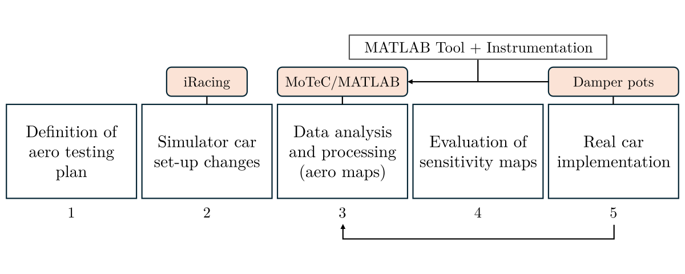
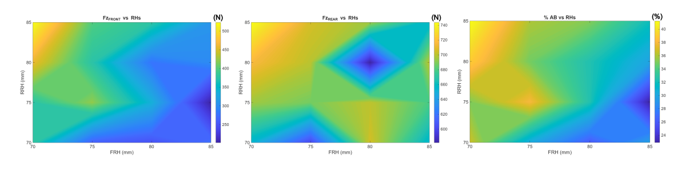

## Objective

Assess the aerodynamic performance of an Audi RS3 LMS TCR by generating aero maps using iRacing data to develop a real track testing and analysis procedure.

---

## Workflow

This project consists of **5 stages**, beginning with the aero testing in iRacing and ending with the methodology adjustments for the real car implementation. Such adjustments are based on the evaluation of the aero maps generated in **stages 3 and 4**, exporting the telemetry with MoTeC i2 and generating the sensitivity maps with a MATLAB script. The MATLAB script is adaptable and ready to be used in **stage 5**.

---

## Results

The aero maps below show the relationship between ride heights and downforce calculated at the dampers. The analysis of aerodynamic loads at the front and rear axles are a useful metric to correlate on-track data, assess performance and to perform informed set-up changes.

---

## Additional Information

For more detail about this project, please refer to my [portfolio](https://github.com/adriancc-eng/motorsport-repo/blob/main/ACC%20Portfolio.pdf) which further outlines the formulations and methods I used. 