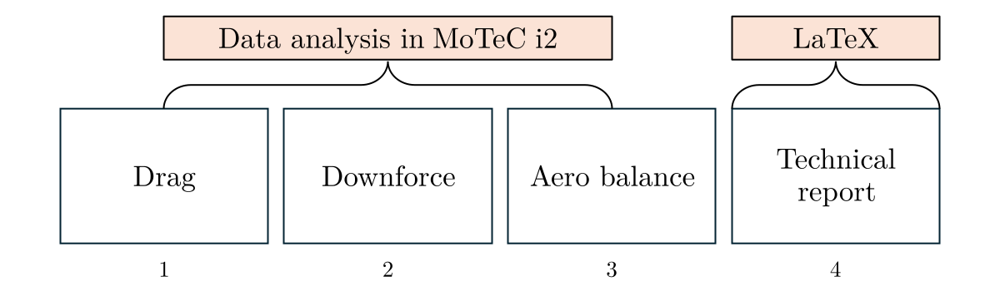
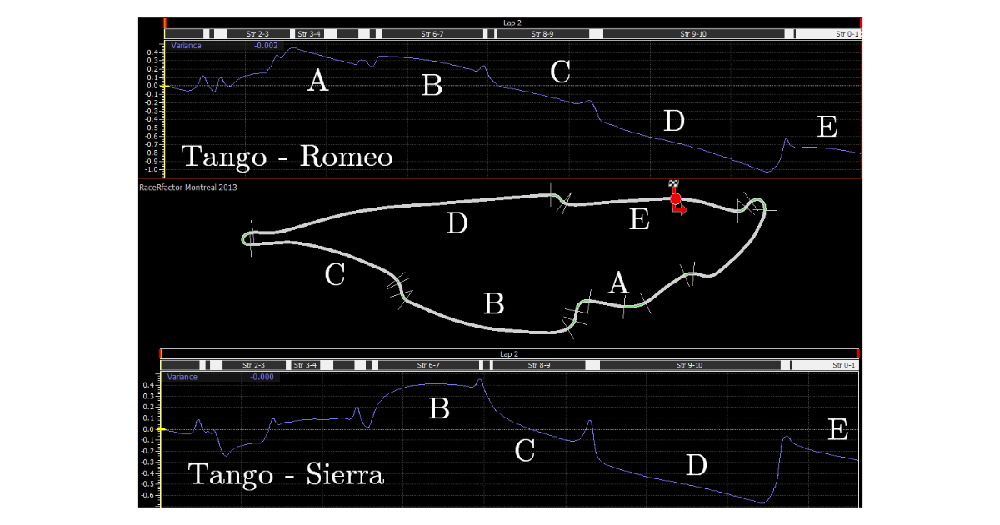
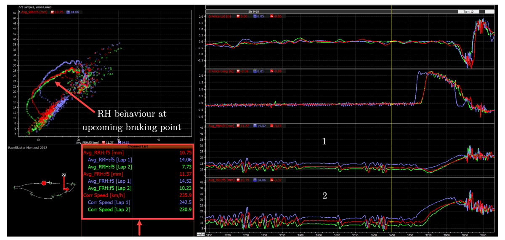

## Objective

Assess drag, aerodynamic balance and total, front and rear downforce on each of the 3 different set-ups to identify their contribution to lap time improvements and the overall performance of the car.  

---

## Assumptions

* Runs performed with the same car and driver
* Only aerodynamic set-up has changed between runs
* No suspension set-up changes or any other chassis related changes have been made
* Starting fuel load and tyres are identical for each run 

---

## Set-Up Test Plan

Each of the three different aero set-ups (Run Romeo, Run Sierra and Run Tango) consists of 1 out-lap, 2 performance laps, and 1 in-lap.

| Run Romeo   | Run Sierra  | Run Tango  |
| ----------  | ----------- | ---------- |
| Out-lap     | Out-lap     | Out-lap    |
| Lap 1       | Lap 1       | Lap 1      |
| Lap 2       | Lap 2       | Lap 2      |
| In-lap      | In-lap      | In-lap     |

---

## Workflow & Summary 

The data is analysed with multiple telemetry channels which are chosen depending on the aerodynamic parameter, as indicated below:

* Drag: 
  * Time gains when braking or accelerating (particularly after long straights) with a **lap time variance curve**.
  * Maximum speeds and acceleration trends with the **vehicle speed** channel.
  * **Brake pedal application** to correlate the effect of drag induced losses on driveability.

* Downforce:
  * Response of the aerodynamic load when accelerating, cornering and braking with the **front and rear ride heights**.
  * Changes in cornering capabilities with the lateral and **longitudinal acceleration** channels.
  * Quantitative analysis using the **suspension load** data. 

* Aero balance:
  * Correlation of the **suspension load, ride height and acceleration** channels.

  

---

## Results

For further detail about the analysis refer to the final report [here](https://github.com/adriancc-eng/motorsport-repo/blob/32cc1b8c9b807d3a66e20aa91746f2d83420411a/ACC%20USF2000%20Data%20Analysis.pdf) or on my GitHub repository.

An initial assessment can be made by plotting a time variance curve. This simple, but insightful tool in MoTeC i2, lays out a general representation of the time reductions on the straights and performance variations during heavy braking in this analysis.

In the next example the front and rear ride heights of the three set-ups are compared (1 & 2). As seen in the map diagram at the left and in the upper two channels, this is done at a high-speed condition where aerodynamic loads become relevant.

The scatter plot in the top left corner shows the changes in front and rear ride heights when braking. Correlating the fastest set-up (Run Tango) with the time variance curve, demonstrates the importance of a low downforce (less drag consequently) in this circuit.

