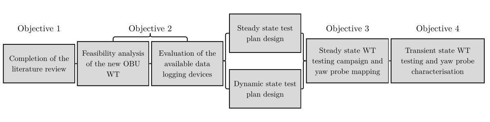

## Objective

Map and characterise a yaw probe based on wind tunnel testing results.

---

## Workflow

The methodology of this project is divided into **4 objectives** as shown below. **Objectives 1 and 2** are directed towards the initial assessment of the new Oxford Brookes wind tunnel. **Objectives 3 and 4** represent the actual wind tunnel tests.

Steady state tests are used to acquire the pressure data at different yaw probe inclinations (as shown in the wind tunnel layout). Dynamic tests involve a constant movement of the yaw probe to characterise its response with a MATLAB script. The calibration guidelines are produced after mapping and characterising the instrument.      

---

## Results

type

---
