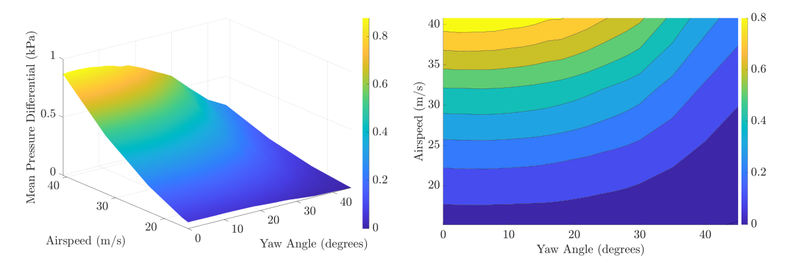
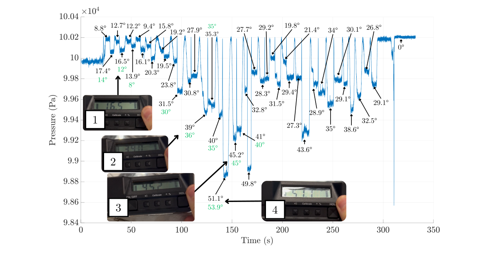

## Objective

Map and characterise a yaw probe based on wind tunnel testing results.

---

## Workflow

The methodology of this project is divided into **4 objectives** as shown below. **Objectives 1 and 2** are directed towards the initial assessment of the new Oxford Brookes wind tunnel. **Objectives 3 and 4** represent the actual wind tunnel tests.

Steady state tests are used to acquire the pressure data at different yaw probe inclinations (as shown in the wind tunnel layout). Dynamic tests involve a constant movement of the yaw probe to characterise its response with a MATLAB script. The calibration guidelines are produced after mapping and characterising the instrument.      

The set of runs during the mapping process were performed as shown in the table below. The maximum airspeed (Run 1) was obtained by setting the fan speed at 100% in the wind tunnel control software.

| Run No.         | Airspeed (m/s)  | 
| ----------      | -----------     | 
| 1               | 43.7            | 
| 2               | 33.6            |  
| 3               | 23.6            | 
| 4               | 15              | 
| 5               | 13.6            | 
| 6               | 6               | 

---

## Results

After completing the steady state tests the following aero map was generated by processing the pressure measurements in MATLAB. The figure on the left is the three-dimensional representation of the relationship between mean pressure differential, airspeed and the inclination of the yaw probe (yaw angle). To present these results more clearly, the contour plot on the right displays the same information in just two dimensions. 

Characterising the instrument involved the estimation of dynamic inclinations based on the previous mapping data by interpolating/extrapolating pressure readings. The black numbers are the theoretical measured readings from the inclinometer (e.g. 1, 2, 3 & 4). The green numbers represent the estimation of the MATLAB script.

---

## Additional Information

Please refer to my [portfolio](https://github.com/adriancc-eng/motorsport-repo/blob/main/ACC%20Portfolio.pdf) to find more detail on the initial equipment validation and final results.  